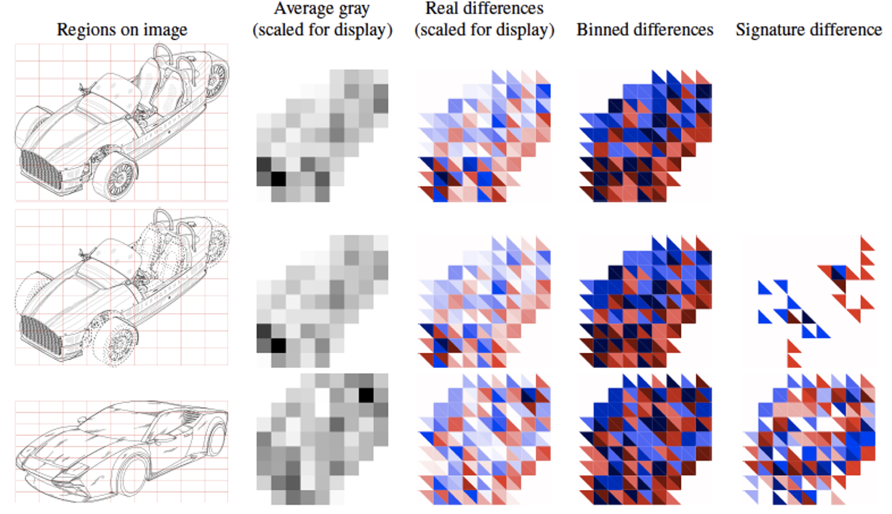

Visual hash for comparing visual similarity of images; which works on a wide variety of image types such as photos, logos, figures, diagrams and drawings.

# VisHash
This repository is the official implementation of [VisHash: Visual Similarity Preserving Image Hashing for
Diagram Retrieval](https://doi.org/10.1117/12.2594720).

## Requirements

* PIL or pillow
* scikit-image
* matplotlib
* scipy
* numpy

## Calculate image hashes
`calc_vishash.py --dataname example --image_path /path/to/images
`

Input is a directory containing images. A hash will be computed for each image. Two files are written: filenames_example.csv and signatures_example.npy, so that the order of the hashes (signatures) matches the order given in filenames_example.csv.

## Find duplicate images
`calc_matches.py --postfix example --threshold 0.2
`

This script will read filenames_example.csv and signatures_example.npy (such as produced by calc_vishash.py). The distance between pairs of image hashes is calculated, then filtered based on the given threshold to output a list of matches in matches_example.csv.

## Evaluation
Evaluation of the algorithm is performed by finding the closest matches in a given dataset, and then evaluating (by hand) whether these matches are correct. The results of this analysis are used to generate a plot of precision versus number of retrieved pairs.

`calc_mindist_allpairs.py --postfix example --n_matches 1000
`

The above example will generate a list of 1000 image-pairs with the lowest distance. The script will read filenames_example.csv and signatures_example.npy (such as produced by calc_vishash.py); and write mindist_example.csv with the list of 1000 matches.

`calc_query_matches.py --postfix example -k 5
`

The above match-per-query example will generate a list of the top-5 matches (hashes with lowest distance) for each of the hashes in the given array of hashes. The script will read filenames_example.csv and signatures_example.npy (such as produced by calc_vishash.py); and write topk_example.csv with the list of top-5 matches per hash.

## Contributing
Send email to contact author (dianeoyen) with any suggestions, concerns or interest in contributing. See [license](LICENSE).
